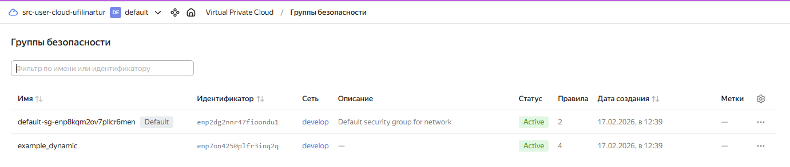
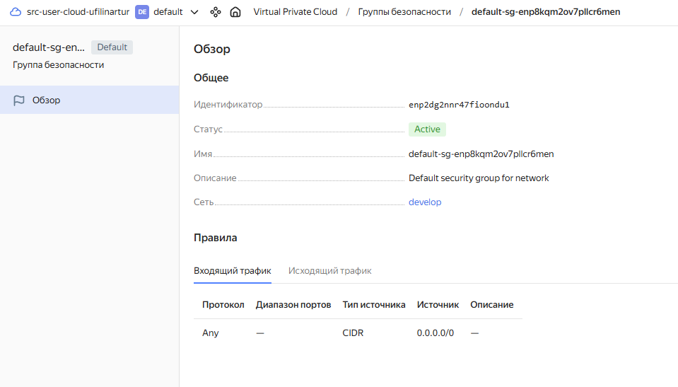
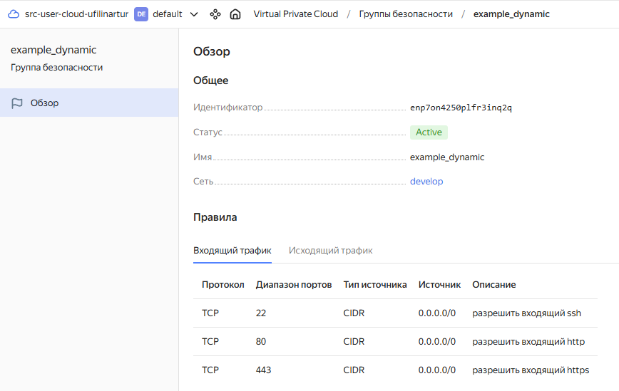
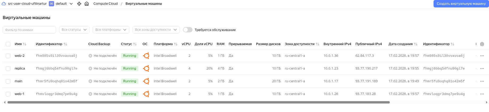
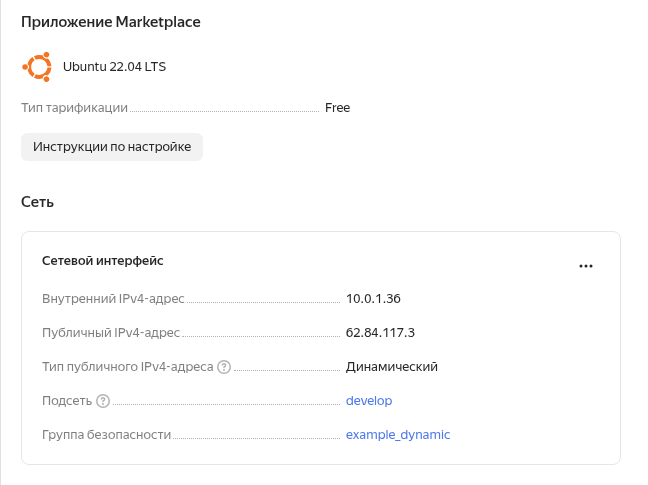
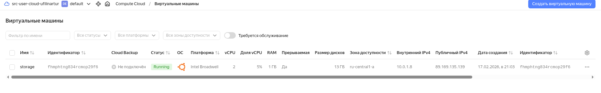
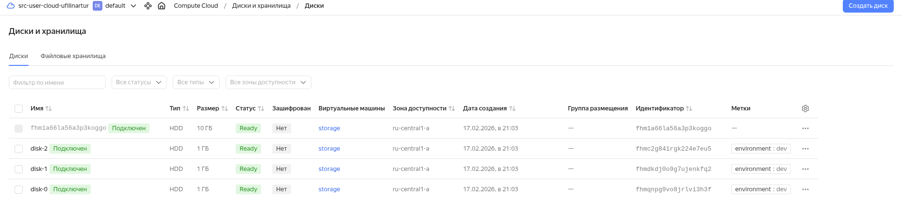
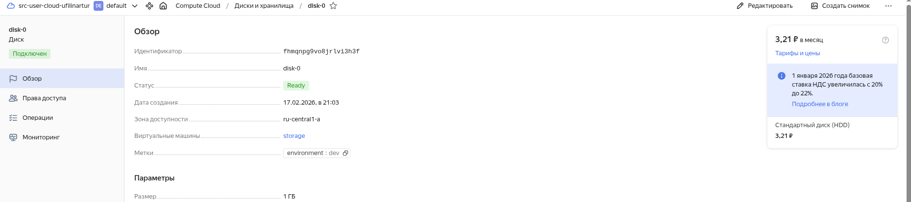

# ter-homeworks-03
HW
###Задание 1
  
>>Группы безопасности и правила в них
  

  

  

  

  
###Задание 2
  
> Результат создания
  

  

  

###Задание 3
  
> Результат создания трёх дтсков и подключения их к созданной ВМ
  

  

  

  

  

###Задание 4

  
